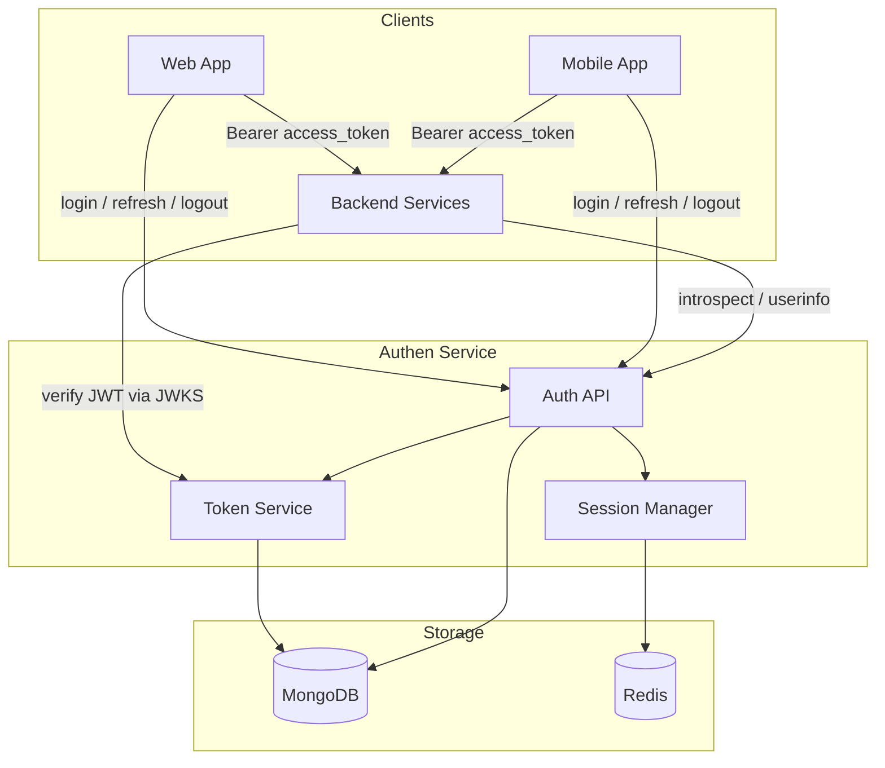
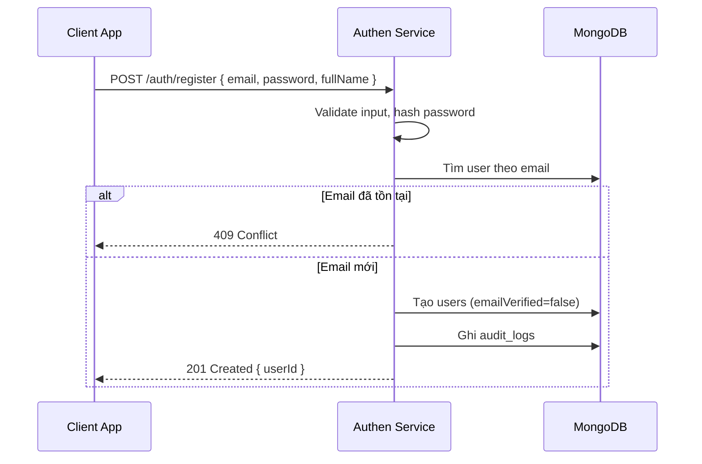
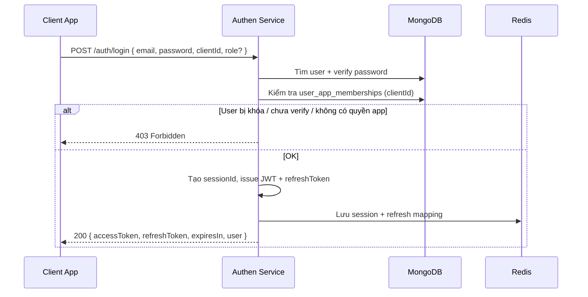
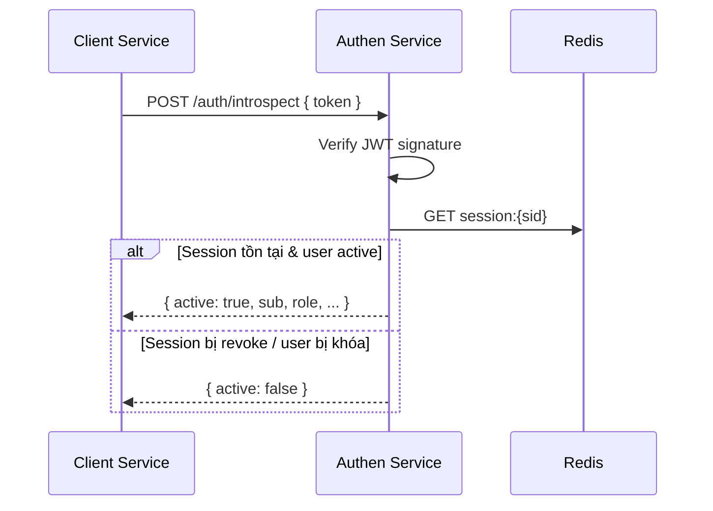
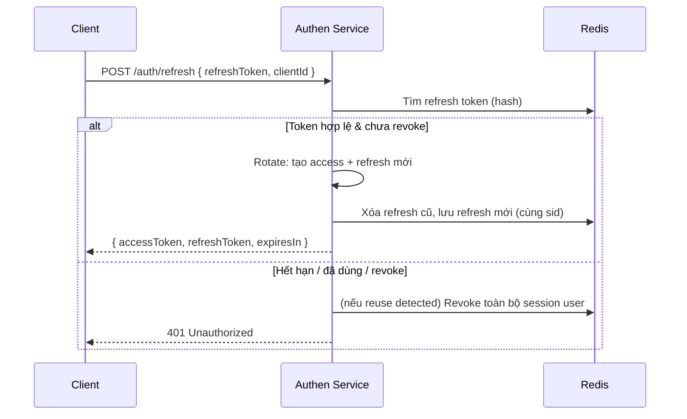
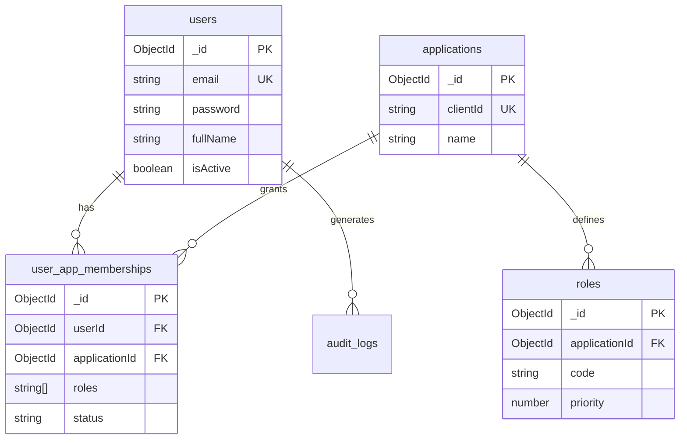

# Authen Service — Thiết kế hệ thống xác thực tập trung

> **Mục đích tài liệu:** Mô tả luồng, kiến trúc và thiết kế database cho `authen-service` — service xác thực dùng chung cho các dự án mới trong hệ sinh thái.  
> **Đối tượng đọc:** Dev / AI triển khai.  
> **Trạng thái:** Bản thiết kế v1 — chưa code.

---

## 1. Bài toán & mục tiêu

### 1.1 Vấn đề cần giải quyết

- Mỗi dự án mới phải tự xây auth riêng (user, password, JWT, session…) → trùng lặp, khó bảo trì.
- Một người dùng có nhiều tài khoản rời rạc giữa các hệ thống.
- Khó thu hồi quyền truy cập tập trung khi khóa tài khoản hoặc đổi mật khẩu.

### 1.2 Mục tiêu của Authen Service

| Mục tiêu | Mô tả |
|---|---|
| **Single Identity** | Một user (email) dùng chung cho mọi ứng dụng |
| **Single Login** | Đăng nhập một lần, truy cập nhiều app (SSO trong hệ sinh thái) |
| **Tách bạch trách nhiệm** | Auth service chỉ lo *ai là ai* và *được vào app nào với vai trò gì*; business data thuộc từng service |
| **Dễ tích hợp** | Các service khác chỉ cần verify token + đọc claims |
| **Thu hồi session** | Logout, khóa user, đổi mật khẩu → vô hiệu token ngay lập tức |
| **Mở rộng** | Sau này có thể nâng lên OAuth2 / OpenID Connect mà không phá vỡ client hiện tại |

### 1.3 Phạm vi v1 (MVP)

**Có trong v1:**

- Đăng ký / đăng nhập email + password
- JWT access token + refresh token
- Session lưu Redis
- Đăng ký ứng dụng (client app) — mỗi dự án là một `application`
- Phân quyền theo app: user có membership + role trên từng app
- JWKS public key để service tự verify JWT
- API introspection (cho route nhạy cảm hoặc khi cần chắc chắn session còn sống)
- Logout / logout all devices / refresh token rotation

**Chưa làm trong v1 (phase sau):**

- Social login (Google, Facebook)
- MFA / OTP
- Central login UI (SSO redirect page) — v1 dùng API login trực tiếp
- Full OAuth2 Authorization Server
- Collection `sessions` trên MongoDB (audit) — dùng Redis là đủ cho v1

---

## 2. Nguyên tắc thiết kế

### 2.1 Auth service làm gì / không làm gì

```
┌─────────────────────────────────────────────────────────────┐
│                    AUTHEN SERVICE                           │
│  ✅ Identity (user, password, trạng thái tài khoản)        │
│  ✅ Session & Token (issue, refresh, revoke)               │
│  ✅ App registry (đăng ký client app)                        │
│  ✅ Membership & Role theo từng app                          │
│  ✅ Audit login / security events                            │
│  ❌ Business data (đơn hàng, khóa học, báo cáo…)           │
│  ❌ Permission nghiệp vụ chi tiết của từng domain           │
│  ❌ Metadata / context riêng của từng app                   │
└─────────────────────────────────────────────────────────────┘
```

### 2.2 Phân tách Identity vs Authorization

| Lớp | Thuộc về | Ví dụ |
|---|---|---|
| **Identity** | Authen Service | `userId`, email, password, `isActive` |
| **App Access** | Authen Service | User được phép vào `my-app` không? Role `ADMIN` hay `USER`? |
| **Domain Permission** | Từng service | `ORDER_CANCEL`, `REPORT_EXPORT` — mỗi app tự quản |

> **Lý do:** Permission nghiệp vụ thay đổi theo từng app, không nên nhồi vào JWT. JWT chỉ mang `sub`, `aud`, `sid`, `role` — service con map role → permission nội bộ.

### 2.3 Token strategy — JWT RS256 + Redis Session

| Thành phần | Cách làm |
|---|---|
| **Access Token** | JWT ký **RS256** (private key chỉ auth service giữ) |
| **Refresh Token** | Opaque random string, chỉ lưu hash trong Redis |
| **Session** | Redis là nguồn sự thật cho session đang active |
| **Verify nhanh** | Client service verify JWT bằng **public key** (JWKS) — không gọi auth mỗi request |
| **Revocation** | Mọi access token gắn `sid` (session id); logout = xóa `session:{sid}` trên Redis |

**Tại sao RS256?**

- Chỉ auth service giữ private key; các service khác chỉ cần public key → an toàn cho kiến trúc đa service.
- Không chia sẻ symmetric secret giữa nhiều codebase.

### 2.4 Chính sách verify token (cần chốt rõ)

| Mức | Khi nào dùng | Cách làm |
|---|---|---|
| **L1 — JWT only** | Route đọc dữ liệu thông thường | Verify signature + `exp` + `aud` bằng JWKS |
| **L2 — JWT + session** | Route ghi dữ liệu / thao tác nhạy cảm | L1 + kiểm tra `session:{sid}` còn tồn tại trên Redis |
| **L3 — Introspect** | Service không muốn tự verify / cần snapshot user mới nhất | `POST /auth/introspect` |

> Access token TTL ngắn (15–30 phút) giảm rủi ro khi chỉ dùng L1. L2 nên là default cho hầu hết route protected.

### 2.5 Convention code

Khi triển khai code:

- NestJS + Mongoose
- Enum `DbCollections` trong `constant.ts`
- Schema class + `@Prop` + `DefinitionsFactory.createForClass()`
- Đăng ký tập trung trong `MongoModule` (Global)
- Plugin Mongoose cho hash password
- Redis cho session cache, key prefix `auth:`

---

## 3. Kiến trúc tổng thể



### 3.1 Luồng tích hợp cho service con

```
Bước 1: User login qua Authen Service → nhận accessToken + refreshToken
Bước 2: Client gửi accessToken trong header Authorization: Bearer <token>
Bước 3: Service con AuthGuard:
         a) Verify JWT signature + exp + aud (JWKS)
         b) Kiểm tra session:{sid} trên Redis (L2) hoặc gọi introspect (L3)
         c) Map claims → request.user
Bước 4: Service con dùng userId (sub) để xử lý business logic
```

**Service con nên:**

- Không lưu password.
- Có thể có collection `users` riêng cho field nghiệp vụ, liên kết qua `authUserId` = JWT `sub`.
- Hoặc không có DB user — chỉ dùng claims + gọi `/auth/userinfo` khi cần profile.

---

## 4. Luồng nghiệp vụ chi tiết

### 4.1 Đăng ký user (Register)



**Quy tắc:**

- Email unique toàn hệ thống.
- Password hash bằng bcrypt (salt configurable).
- **Register không tự gán membership vào app** — tránh mở cửa truy cập trái phép.
- User được cấp quyền vào app qua: admin gán membership, hoặc invite token (phase 1.1).
- Gửi email verify (phase 1.1): tạo `verification_tokens`, `emailVerified: false`.

---

### 4.2 Đăng nhập (Login)



**Request body:**

```json
{
  "email": "user@example.com",
  "password": "********",
  "clientId": "my-app",
  "role": "ADMIN"
}
```

**Response:**

```json
{
  "accessToken": "eyJhbG...",
  "refreshToken": "rt_abc123...",
  "expiresIn": 1800,
  "tokenType": "Bearer",
  "user": {
    "id": "665f...",
    "email": "user@example.com",
    "fullName": "Nguyen Van A",
    "role": "ADMIN"
  }
}
```

**Logic chọn role khi login:**

1. Client gửi `role` mong muốn nếu user có nhiều role trên app.
2. Auth service kiểm tra `role` có trong `user_app_memberships.roles` không.
3. Nếu không gửi `role` → lấy role có `priority` cao nhất (định nghĩa trong collection `roles`).
4. JWT chỉ mang **một** `role` đang active — tránh mơ hồ khi check quyền ở service con.

---

### 4.3 Access Token — JWT Claims

Payload tối thiểu (không nhét PII dễ stale):

```json
{
  "iss": "https://auth.yourdomain.com",
  "sub": "665f1a2b3c4d5e6f7a8b9c0",
  "aud": "my-app",
  "sid": "sess_8f3a2b1c",
  "role": "ADMIN",
  "iat": 1710000000,
  "exp": 1710001800,
  "jti": "unique-token-id"
}
```

| Claim | Ý nghĩa |
|---|---|
| `sub` | `userId` — foreign key ở service con |
| `aud` | `clientId` — token phát hành cho app nào |
| `sid` | Session ID — check revocation trên Redis |
| `role` | Role đang active tại thời điểm login |
| `jti` | Token ID — blacklist từng token nếu cần |

**Không đưa vào JWT:** email, fullName, permissions, metadata app — lấy qua `/auth/userinfo` hoặc internal API khi cần.

---

### 4.4 Verify token ở service con

**Cách 1 — Local verify + session check (khuyến nghị):**

```
1. Lấy public key từ GET /.well-known/jwks.json (cache 24h)
2. jwt.verify(token, publicKey, { algorithms: ['RS256'], audience: '<clientId>' })
3. GET auth:session:{sid} trên Redis — không tồn tại → 401
```

**Cách 2 — Introspect:**



---

### 4.5 Refresh Token



**Refresh token rotation:** Mỗi lần refresh → refresh token cũ bị vô hiệu. Reuse refresh token cũ → revoke all sessions (dấu hiệu token bị đánh cắp).

---

### 4.6 Logout

| API | Hành vi |
|---|---|
| `POST /auth/logout` | Revoke session hiện tại (access + refresh) |
| `POST /auth/logout-all` | Revoke mọi session của user |

```
1. Parse access token → lấy sid, userId
2. Redis DEL auth:session:{sid}
3. Redis DEL auth:refresh:{hash} liên kết
4. Redis SREM auth:user:sessions:{userId} sid
5. Ghi audit_logs
```

---

### 4.7 Khóa user / đổi mật khẩu

```
1. Cập nhật MongoDB (isActive=false hoặc changePasswordAt=now)
2. SessionManager.revokeAllSessions(userId)
3. Token cũ fail ở bước session check / introspect
```

---

### 4.8 Service-to-Service (M2M) — Phase 2

```
POST /auth/token
grant_type=client_credentials
client_id=my-app-worker
client_secret=***
```

→ JWT với `sub = service:{clientId}`, không có user context.

---

## 5. Thiết kế Database (MongoDB)

### 5.1 Danh sách collections

| Collection | MVP | Mục đích |
|---|---|---|
| `users` | ✅ | Identity toàn hệ thống |
| `applications` | ✅ | Đăng ký client app |
| `roles` | ✅ | Định nghĩa role hợp lệ theo app |
| `user_app_memberships` | ✅ | User ↔ App ↔ Roles |
| `audit_logs` | ✅ | Login, logout, đổi password, failed attempts |
| `verification_tokens` | Phase 1.1 | Email verify, reset password |
| `sessions` | Phase 1.1 | Audit session trên MongoDB (Redis vẫn là chính) |

> **Không tạo collection `permissions`** — permission nghiệp vụ do từng app tự quản theo `role` trong JWT.

### 5.2 Enum `DbCollections`

```typescript
export enum DbCollections {
  USER = 'users',
  APPLICATION = 'applications',
  ROLE = 'roles',
  USER_APP_MEMBERSHIP = 'user_app_memberships',
  AUDIT_LOG = 'audit_logs',
  VERIFICATION_TOKEN = 'verification_tokens',
  SESSION = 'sessions',           // phase 1.1
}
```

---

### 5.3 Collection: `users`

| Field | Type | Index | Mô tả |
|---|---|---|---|
| `_id` | ObjectId | PK | User ID = JWT `sub` |
| `email` | string | unique | Đăng nhập |
| `password` | string | — | Bcrypt hash |
| `fullName` | string | — | Tên hiển thị |
| `phoneNumber` | string | sparse unique | Tuỳ chọn |
| `avatarUrl` | string | — | Tuỳ chọn |
| `emailVerified` | boolean | — | default `false` |
| `isActive` | boolean | index | default `true` |
| `isDeleted` | boolean | — | Soft delete |
| `lastLoginAt` | Date | — | |
| `changePasswordAt` | Date | — | Invalidate session khi đổi password |
| `createdAt` | Date | — | timestamps |
| `updatedAt` | Date | — | timestamps |

**Indexes:**

```javascript
{ email: 1 }                    // unique
{ phoneNumber: 1 }              // sparse unique
{ isActive: 1, isDeleted: 1 }
```

**Plugin:** hash password on save/update.

---

### 5.4 Collection: `applications`

| Field | Type | Index | Mô tả |
|---|---|---|---|
| `_id` | ObjectId | PK | |
| `clientId` | string | unique | Dùng làm JWT `aud` |
| `clientSecretHash` | string | — | Bcrypt hash, cho M2M (phase 2) |
| `name` | string | — | |
| `description` | string | — | |
| `allowedOrigins` | string[] | — | CORS whitelist |
| `redirectUris` | string[] | — | SSO redirect (phase 2) |
| `accessTokenTtl` | number | — | Giây, override global |
| `refreshTokenTtl` | number | — | Giây |
| `isActive` | boolean | index | |
| `createdAt` | Date | — | |
| `updatedAt` | Date | — | |

**Indexes:** `{ clientId: 1 }` unique, `{ isActive: 1 }`

> `defaultRole` **không** để ở đây — dùng `roles.isDefault` để tránh hai nguồn sự thật.

---

### 5.5 Collection: `roles`

| Field | Type | Index | Mô tả |
|---|---|---|---|
| `_id` | ObjectId | PK | |
| `applicationId` | ObjectId | ref applications | |
| `code` | string | compound unique | `ADMIN`, `USER`, `VIEWER`… |
| `name` | string | — | Tên hiển thị |
| `description` | string | — | |
| `isDefault` | boolean | — | Role mặc định khi được gán vào app |
| `priority` | number | — | Cao hơn = ưu tiên khi login không chỉ định role |
| `isActive` | boolean | — | |
| `createdAt` | Date | — | |
| `updatedAt` | Date | — | |

**Indexes:**

```javascript
{ applicationId: 1, code: 1 }   // unique
{ applicationId: 1, isDefault: 1 }
```

Mỗi app tự định nghĩa role khi onboard — không hardcode role chung toàn hệ thống.

---

### 5.6 Collection: `user_app_memberships`

| Field | Type | Index | Mô tả |
|---|---|---|---|
| `_id` | ObjectId | PK | |
| `userId` | ObjectId | compound unique | ref users |
| `applicationId` | ObjectId | compound unique | ref applications |
| `roles` | string[] | — | Mảng `roles.code` |
| `status` | enum | index | `ACTIVE` \| `SUSPENDED` \| `PENDING` |
| `grantedBy` | ObjectId | — | Admin cấp quyền |
| `grantedAt` | Date | — | |
| `createdAt` | Date | — | |
| `updatedAt` | Date | — | |

**Indexes:**

```javascript
{ userId: 1, applicationId: 1 }   // unique
{ applicationId: 1, status: 1 }
{ userId: 1, status: 1 }
```

**Ví dụ:**

```json
{
  "userId": "665f1a2b3c4d5e6f7a8b9c0",
  "applicationId": "665f00000000000000000001",
  "roles": ["ADMIN", "USER"],
  "status": "ACTIVE"
}
```

**Lưu ý:** Không lưu `metadata` app-specific ở đây. Context nghiệp vụ (departmentId, tenantId…) thuộc service con, link qua `userId`.

**Login query tối ưu (1 round-trip):**

```javascript
// Sau khi tìm user theo email, dùng aggregation:
db.user_app_memberships.aggregate([
  { $match: { userId, status: 'ACTIVE' } },
  { $lookup: { from: 'applications', localField: 'applicationId', foreignField: '_id', as: 'app' } },
  { $match: { 'app.clientId': clientId, 'app.isActive': true } },
])
```

Hoặc cache `clientId → applicationId` trong Redis (`auth:app:{clientId}`).

---

### 5.7 Collection: `audit_logs`

| Field | Type | Mô tả |
|---|---|---|
| `userId` | ObjectId | nullable khi login fail |
| `applicationId` | ObjectId | nullable |
| `action` | enum | `LOGIN_SUCCESS`, `LOGIN_FAILED`, `LOGOUT`, `REFRESH`, `PASSWORD_CHANGE`, `USER_BLOCKED` |
| `ip` | string | |
| `userAgent` | string | |
| `metadata` | Mixed | sessionId, lý do fail… |
| `createdAt` | Date | TTL 90 ngày (tuỳ chính sách) |

**Indexes:** `{ userId: 1, createdAt: -1 }`, `{ action: 1, createdAt: -1 }`, `{ createdAt: 1 }` TTL

---

### 5.8 Collection: `verification_tokens` (Phase 1.1)

| Field | Type | Mô tả |
|---|---|---|
| `userId` | ObjectId | |
| `type` | enum | `EMAIL_VERIFY` \| `PASSWORD_RESET` |
| `tokenHash` | string | unique |
| `expiresAt` | Date | TTL index |
| `usedAt` | Date | nullable |
| `createdAt` | Date | |

> Token ngắn hạn có thể chỉ dùng Redis (`auth:verify:{hash}`) thay MongoDB — đơn giản hơn cho MVP.

---

### 5.9 ERD tổng quan



---

## 6. Thiết kế Redis

### 6.1 Key patterns (đã đơn giản hoá)

| Key | Value | TTL | Mục đích |
|---|---|---|---|
| `auth:session:{sid}` | JSON session context | = access token TTL | Nguồn sự thật session |
| `auth:refresh:{tokenHash}` | `{ sid, userId, clientId }` | = refresh token TTL | Validate refresh |
| `auth:user:sessions:{userId}` | Set of `sid` | Không TTL — cleanup khi revoke | Logout all devices |
| `auth:app:{clientId}` | `{ applicationId, accessTokenTtl, refreshTokenTtl }` | 1h | Cache app config |
| `auth:jwks` | JSON public keys | 24h | Cache JWKS (phía auth service) |

> **Đã bỏ** `active:access:{userId}:{ts}` và `active:refresh:{userId}:{ts}` — dư thừa khi đã có `auth:session:{sid}` + `auth:user:sessions:{userId}`.

### 6.2 Session context

```json
{
  "userId": "665f1a2b3c4d5e6f7a8b9c0",
  "clientId": "my-app",
  "role": "ADMIN",
  "isActive": true
}
```

Profile (email, fullName) không cache trong session — query `users` khi cần hoặc dùng `/auth/userinfo`.

### 6.3 Revoke flow

```
revokeSession(sid):
  1. GET auth:session:{sid} → lấy userId
  2. DEL auth:session:{sid}
  3. DEL auth:refresh:* liên kết sid
  4. SREM auth:user:sessions:{userId} sid

revokeAllSessions(userId):
  1. SMEMBERS auth:user:sessions:{userId}
  2. Với mỗi sid → revokeSession(sid)
  3. DEL auth:user:sessions:{userId}
```

---

## 7. API Specification (v1)

### 7.1 Public endpoints

| Method | Path | Mô tả |
|---|---|---|
| `POST` | `/auth/register` | Đăng ký user (chỉ tạo identity) |
| `POST` | `/auth/login` | Đăng nhập, trả token |
| `POST` | `/auth/refresh` | Refresh token rotation |
| `POST` | `/auth/logout` | Logout session hiện tại |
| `GET` | `/.well-known/jwks.json` | Public keys |
| `GET` | `/auth/userinfo` | Profile từ access token |

### 7.2 Phase 1.1

| Method | Path | Mô tả |
|---|---|---|
| `POST` | `/auth/forgot-password` | Gửi email reset |
| `POST` | `/auth/reset-password` | Đặt lại password |
| `POST` | `/auth/verify-email` | Xác thực email |
| `POST` | `/auth/logout-all` | Logout mọi thiết bị |

### 7.3 Internal / Service endpoints

| Method | Path | Auth | Mô tả |
|---|---|---|---|
| `POST` | `/auth/introspect` | `clientSecret` hoặc service JWT | Verify token + session |
| `GET` | `/internal/users/:id` | service JWT | Lấy profile user |
| `GET` | `/internal/users/:id/memberships` | service JWT | Danh sách app + role |
| `POST` | `/internal/memberships` | service JWT | Gán user vào app |

### 7.4 Admin endpoints (Phase 1.1)

| Method | Path | Mô tả |
|---|---|---|
| `CRUD` | `/admin/applications` | Quản lý app |
| `CRUD` | `/admin/roles` | Quản lý role theo app |
| `POST` | `/admin/memberships` | Gán / thu hồi quyền user trên app |
| `POST` | `/admin/users/:id/block` | Khóa user + revoke sessions |
| `GET` | `/admin/users` | Danh sách user |
| `GET` | `/admin/audit-logs` | Lịch sử auth |

---

## 8. Tích hợp cho service con

### 8.1 SDK dùng chung (khuyến nghị)

```typescript
AuthSdkModule.forRoot({
  jwksUri: 'https://auth.example.com/.well-known/jwks.json',
  audience: 'my-app',
  redisUrl: '...',              // optional — check session L2 local
  introspectUrl: '...',         // optional — L3
})
```

```typescript
interface AuthUser {
  id: string;        // sub
  role: string;
  clientId: string;  // aud
  sessionId: string; // sid
}
```

### 8.2 Mapping role → permission ở service con

Mỗi app tự định nghĩa:

```typescript
const ROLE_PERMISSIONS: Record<string, string[]> = {
  ADMIN: ['resource:write', 'resource:delete'],
  USER: ['resource:read'],
};
```

```
AuthGuard (SDK) → verify JWT + session
PermissionGuard → map role → permissions nội bộ
```

### 8.3 Đồng bộ user profile

| Cách | Khi nào dùng |
|---|---|
| **Chỉ dùng JWT + userinfo** | App đơn giản, ít field profile |
| **Local user table + authUserId** | App có field nghiệp vụ riêng (mã nhân viên, cấp bậc nội bộ…) |

### 8.4 Biến môi trường service con

```env
AUTH_JWKS_URI=https://auth.example.com/.well-known/jwks.json
AUTH_AUDIENCE=my-app
AUTH_REDIS_URL=redis://...          # nếu check session L2 trực tiếp
AUTH_INTROSPECT_URL=https://auth.example.com/auth/introspect
AUTH_SERVICE_CLIENT_ID=my-app
AUTH_SERVICE_CLIENT_SECRET=***
```

---

## 9. Bảo mật

| Hạng mục | Yêu cầu |
|---|---|
| Password | Bcrypt, min 8 ký tự |
| JWT | RS256, access TTL 15–30 phút |
| Refresh | Opaque, rotation, reuse detection |
| Rate limit | Login / register: 10 req/phút/IP |
| CORS | Theo `applications.allowedOrigins` |
| Register | Không auto-grant app access |
| Secret | Private key, clientSecret trong vault/env |
| Audit | Ghi login fail; lock sau N lần fail (phase 1.1) |
| HTTPS | Bắt buộc production |

---

## 10. Kế hoạch triển khai

### Phase 1 — MVP

- [ ] NestJS + MongoDB + Redis
- [ ] Collections: `users`, `applications`, `roles`, `user_app_memberships`, `audit_logs`
- [ ] API: register, login, refresh, logout, userinfo, jwks
- [ ] JWT RS256 + Redis session manager
- [ ] Admin seed: tạo app + roles qua script hoặc API
- [ ] `@your-org/auth-sdk` (JWT + session guard)

### Phase 1.1 — Hardening

- [ ] Email verify, forgot/reset password
- [ ] Invite token để gán membership khi register
- [ ] Admin API đầy đủ
- [ ] Rate limiting, account lockout
- [ ] `sessions` collection audit (tuỳ chọn)

### Phase 2 — SSO & M2M

- [ ] Central login page + Authorization Code PKCE
- [ ] Client credentials grant
- [ ] Social login

---

## 11. Cấu trúc thư mục đề xuất

```
authen-service/
├── config/
├── docs/
│   └── auth-service-design.md
├── src/
│   ├── common/
│   │   ├── constant.ts
│   │   ├── plugins/
│   │   └── guards/
│   ├── shared/
│   │   ├── db/
│   │   │   ├── mongo.module.ts
│   │   │   └── models/
│   │   └── cache/
│   └── modules/
│       ├── auth/
│       ├── token/
│       ├── session/
│       ├── application/
│       ├── membership/
│       └── admin/
└── packages/
    └── auth-sdk/
```

---

## 12. Quyết định thiết kế (ADR)

| # | Quyết định | Lý do |
|---|---|---|
| 1 | MongoDB + Redis | Phù hợp stack NestJS, session revoke realtime |
| 2 | JWT RS256 | Multi-service an toàn, không chia sẻ secret |
| 3 | Redis session bắt buộc | Revoke tức thì qua `sid` |
| 4 | `user_app_memberships` tách riêng | Scale đa app, query login gọn |
| 5 | Permission ở service con | JWT nhỏ, domain không leak |
| 6 | JWT mang 1 `role` | Rõ ràng khi authorize |
| 7 | Register không auto-grant app | Tránh lỗ hổng truy cập |
| 8 | Không `metadata` trong membership | Auth không ôm context nghiệp vụ |

---

## 13. Checklist trước khi code

- [ ] Chốt domain (`auth.example.com`)
- [ ] Generate RSA key pair, lưu an toàn
- [ ] Chốt TTL: access 15–30 phút, refresh 7 ngày
- [ ] MongoDB database riêng cho auth
- [ ] Redis với prefix `auth:`
- [ ] Quy ước onboard app mới: ai tạo `application` + `roles` + gán `membership`

---

*Tài liệu v1 — đủ để bắt đầu Phase 1. Cập nhật version tại đây trước khi thay đổi kiến trúc.*
