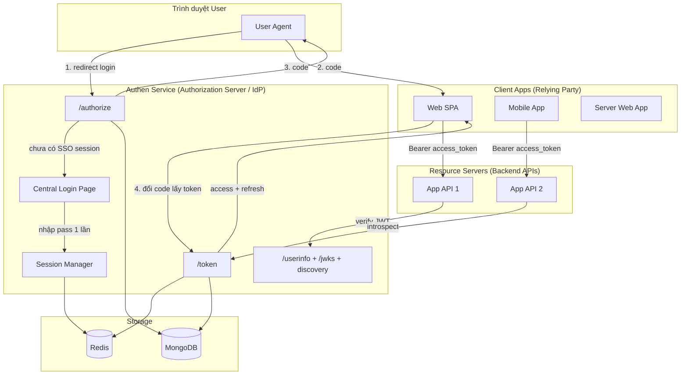
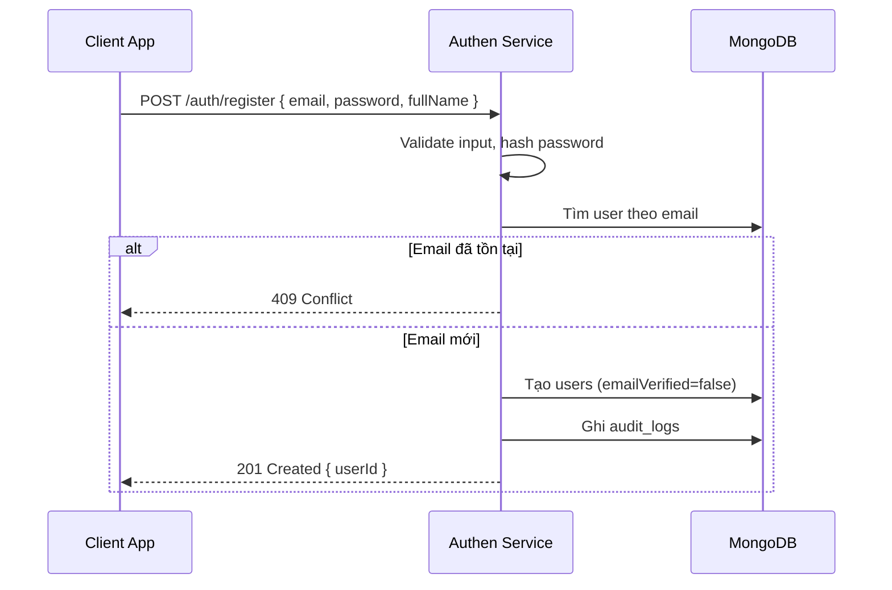
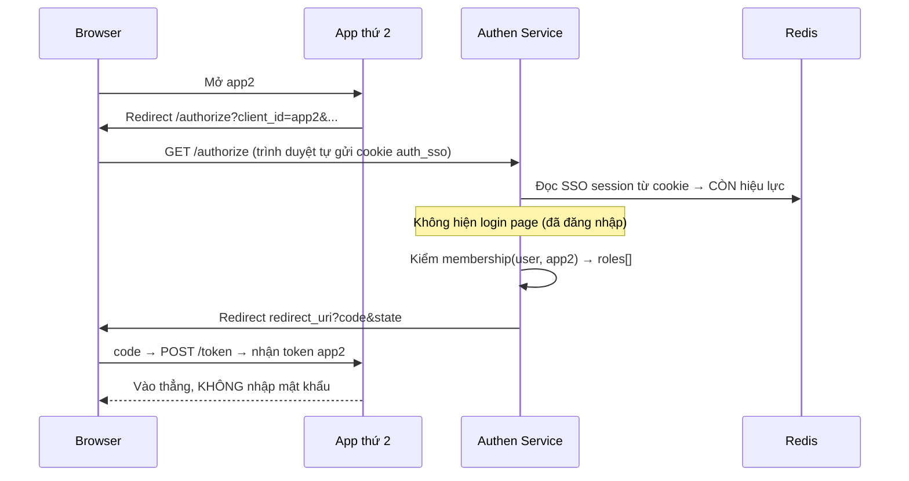
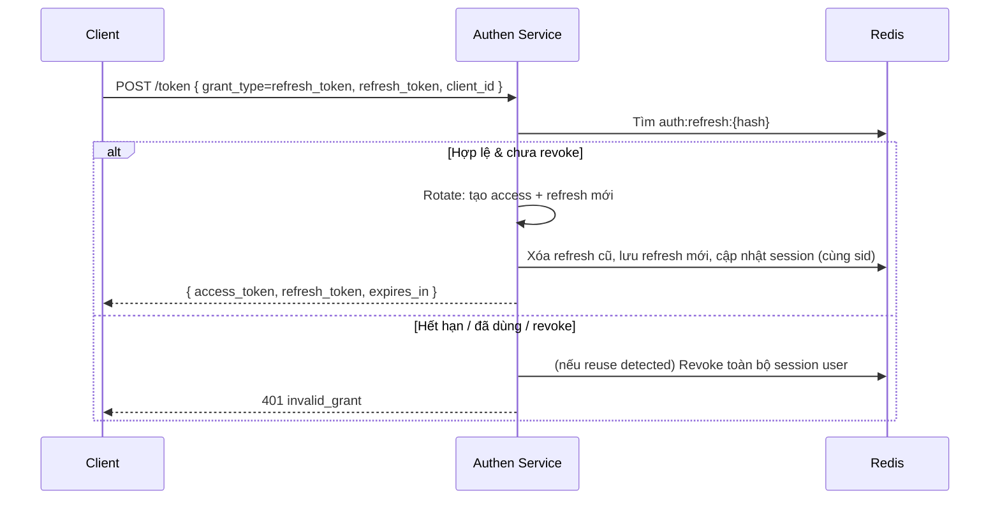
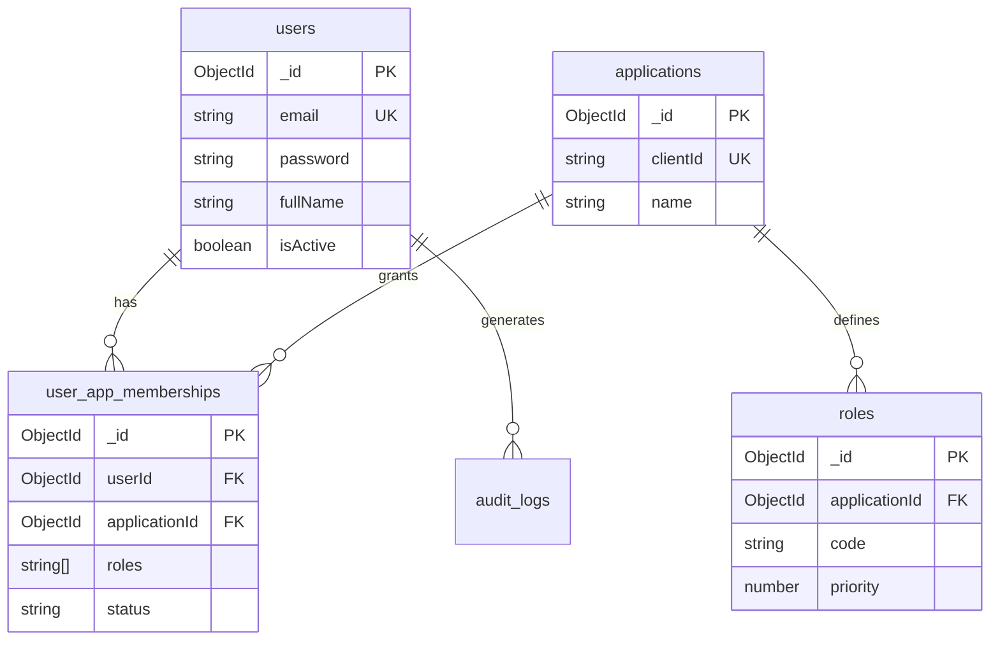

# Authen Service — Thiết kế hệ thống SSO tập trung (OAuth2 / OIDC)

> **Mục đích tài liệu:** Mô tả luồng, kiến trúc và thiết kế database cho `authen-service` — **Identity Provider (IdP) / SSO** dùng chung cho mọi dự án trong hệ sinh thái.  
> **Đối tượng đọc:** Dev / AI triển khai.  
> **Trạng thái:** Bản thiết kế v1 — chưa code.  
> **Cơ chế chính:** **SSO thật** theo chuẩn **OAuth2 Authorization Code + PKCE** và **OpenID Connect (OIDC)** — đăng nhập **một lần**, vào mọi app không nhập lại.

---

## 1. Bài toán & mục tiêu

### 1.1 Vấn đề cần giải quyết

- Mỗi dự án mới phải tự xây auth riêng (user, password, JWT, session…) → trùng lặp, khó bảo trì.
- Một người dùng có nhiều tài khoản rời rạc giữa các hệ thống.
- Khó thu hồi quyền truy cập tập trung khi khóa tài khoản hoặc đổi mật khẩu.

### 1.2 Mục tiêu của Authen Service

| Mục tiêu | Mô tả |
|---|---|
| **Single Identity** | Một user (email) dùng chung cho mọi ứng dụng |
| **Single Sign-On (SSO)** | Đăng nhập **một lần** tại trang login trung tâm → vào mọi app **không nhập lại** mật khẩu |
| **Single Logout (SLO)** | Đăng xuất một chỗ → vô hiệu phiên ở mọi app |
| **Chuẩn mở** | Theo **OAuth2 + OIDC** — client dùng thư viện chuẩn, dễ tích hợp, không khóa cứng |
| **Tách bạch trách nhiệm** | Auth lo *ai là ai* và *được vào app nào với vai trò gì*; business data thuộc từng service |
| **Thu hồi session** | Logout, khóa user, đổi mật khẩu → vô hiệu token ngay lập tức |

### 1.3 Phạm vi v1 (MVP)

**Có trong v1 (SSO đầy đủ):**

- **Authorization Server** theo OAuth2: endpoint `/authorize` + `/token`
- **PKCE** (bắt buộc cho client public: SPA, mobile)
- **OIDC**: ID token, `/userinfo`, discovery `/.well-known/openid-configuration`, JWKS
- **Central login page** (trang đăng nhập trung tâm trên domain auth)
- **SSO session** (cookie phiên trung tâm) → app thứ 2 trở đi vào **không nhập lại**
- Đăng ký / đăng nhập email + password (tại central login page)
- JWT access token + refresh token (refresh rotation)
- Đăng ký ứng dụng (`application`) + `redirectUris`
- Phân quyền theo app: membership + đa role
- Per-app session để revoke + **Single Logout**
- Token introspection (cho resource server kiểm tra realtime)

**Chưa làm trong v1 (phase sau):**

- Social login (Google, Facebook) — thêm sau, không phá luồng
- MFA / OTP
- M2M `client_credentials` grant (service gọi service không có user)
- Consent screen tuỳ biến (v1 auto-consent cho app nội bộ)
- Collection `sessions` trên MongoDB (audit) — Redis là đủ cho v1

> **Mô hình v1 (SSO thật):** User đăng nhập **một lần** tại `auth.example.com`. Mỗi app lấy token qua luồng **redirect → /authorize → code → /token** (không tự thu thập mật khẩu). App thứ 2 trở đi: auth nhận diện **SSO session cookie** → cấp token **không hỏi mật khẩu lại**. Mỗi app vẫn nhận access token riêng (`aud = clientId`) với role riêng theo app.

---

## 2. Nguyên tắc thiết kế

### 2.1 Auth service làm gì / không làm gì

```
┌─────────────────────────────────────────────────────────────┐
│              AUTHEN SERVICE (IdP / SSO)                     │
│  ✅ Identity (user, password, trạng thái tài khoản)        │
│  ✅ Central login page + SSO session (cookie trung tâm)    │
│  ✅ OAuth2 /authorize + /token + PKCE                       │
│  ✅ OIDC: ID token, /userinfo, discovery, JWKS             │
│  ✅ App registry (client app + redirectUris)               │
│  ✅ Membership & Role theo từng app                          │
│  ✅ Issue / refresh / revoke token, Single Logout          │
│  ✅ Audit login / security events                            │
│  ❌ Business data (đơn hàng, khóa học, báo cáo…)           │
│  ❌ Permission nghiệp vụ chi tiết của từng domain           │
│  ❌ Metadata / context riêng của từng app                   │
└─────────────────────────────────────────────────────────────┘
```

### 2.2 Phân tách Identity vs Authorization

| Lớp | Thuộc về | Ví dụ |
|---|---|---|
| **Identity** | Authen Service | `userId`, email, password, `isActive` |
| **App Access** | Authen Service | User được phép vào `my-app` không? Role `ADMIN` hay `USER`? |
| **Domain Permission** | Từng service | `ORDER_CANCEL`, `REPORT_EXPORT` — mỗi app tự quản |

> **Lý do:** Permission nghiệp vụ thay đổi theo từng app, không nên nhồi vào JWT. JWT chỉ mang `sub`, `aud`, `sid`, `role` — service con map role → permission nội bộ.

### 2.3 Các loại "token / phiên" trong hệ SSO

Hệ SSO có **3 tầng** khác nhau — đừng nhầm lẫn:

| # | Loại | Sống ở đâu | Vai trò | TTL |
|---|---|---|---|---|
| 1 | **SSO session** (cookie trung tâm) | Cookie `HttpOnly` trên `auth.example.com` + Redis `auth:sso:{ssoId}` | "User đã đăng nhập vào SSO" — giúp app sau **không phải login lại** | Dài (vd 7–30 ngày, sliding) |
| 2 | **Authorization code** | Redis `auth:authcode:{code}` | Mã tạm trung gian để đổi lấy token (one-time, sống ~60s) | Rất ngắn |
| 3a | **Access token** (per-app) | JWT RS256 (client giữ) | Gọi API của app, `aud = clientId` | Ngắn (15–30') |
| 3b | **Refresh token** (per-app) | Opaque, Redis `auth:refresh:{hash}` | Làm mới access token | Vừa (vd 7 ngày) |
| 3c | **App session** | Redis `auth:session:{sid}` | Nguồn sự thật để revoke token của app | = refresh TTL |

> **Phân biệt cốt lõi:**
> - **SSO session (1)** = "đã đăng nhập trung tâm" → quyết định *có phải nhập mật khẩu không*.
> - **App session + token (3)** = quyền truy cập **một app cụ thể** → cấp riêng cho từng app sau khi qua `/authorize`.
> - Một **SSO session** sinh ra **nhiều app session** (mỗi app một `sid`). SLO = xoá SSO session + mọi app session con.

**Token strategy (giữ Cách A):** Access token là **JWT RS256** (resource server verify offline bằng JWKS); refresh token **opaque** lưu hash trên Redis có rotation. Không lưu nguyên access token vào Redis.

**Tại sao RS256?**

- Chỉ auth service giữ private key; resource server chỉ cần public key → an toàn cho kiến trúc đa service.
- Không chia sẻ symmetric secret giữa nhiều codebase.

### 2.4 Chính sách verify token (L1 / L2 / L3)

> **Quan trọng — đọc kỹ:** L1/L2/L3 **KHÔNG phải 3 API** và **không phải code 3 lần**. Chúng là **3 mức kiểm tra trong cùng một `AuthGuard`** ở phía service con (nằm trong SDK dùng chung). Mỗi route chọn mức bằng 1 decorator. Phía auth service chỉ cần viết **1 API** là `/auth/introspect` (dùng cho L3); L1 và L2 không gọi API nào của auth.

| Mức | Service con làm gì | Gọi API auth? | Cần Redis auth? | Bắt logout/khóa ngay? |
|---|---|---|---|---|
| **L1 — JWT only** | Tự verify chữ ký JWT + `exp` + `aud` bằng public key (JWKS) | Không | Không | Không (chờ tới khi token `exp`) |
| **L2 — JWT + session** | L1 + đọc `auth:session:{sid}` trên Redis | Không | **Có** (đọc Redis) | Có |
| **L3 — Introspect** | Gọi `POST /auth/introspect`, auth check hộ | Có (1 API) | Không | Có |

**Chốt cho hệ nhiều dự án:**
- **Mặc định L1** cho hầu hết route — service con chỉ cần public key, **không đụng Redis auth**.
- Route nhạy cảm (xóa tài khoản, thanh toán…) → **L3** cho dự án ngoài (không cần Redis), hoặc **L2** chỉ khi app cùng hạ tầng với auth.

#### 2.4.1 L1 hoạt động thế nào? (cơ chế chữ ký)

Auth service có **cặp khóa**:

| Khóa | Ai giữ | Vai trò |
|---|---|---|
| **Private key** | Chỉ auth service | **Ký** token khi login |
| **Public key** | Phát công khai cho mọi app (qua JWKS) | **Kiểm tra** chữ ký |

Tính chất: ký bằng private key thì chỉ public key cùng cặp verify đúng; có public key **không** làm giả được chữ ký.

```
Khi login (auth service):
  payload = { sub, roles, exp, ... }
  signature = SIGN(payload, PRIVATE_KEY)
  token = base64(header).base64(payload).signature

Khi verify L1 (service con, tự làm, không gọi ai):
  1. Tách token thành (header, payload, signature)
  2. Lấy PUBLIC_KEY (tải 1 lần từ /.well-known/jwks.json, cache 24h)
  3. VERIFY(header + payload, signature, PUBLIC_KEY)
       khớp  → token thật, chưa bị sửa
       lệch  → token giả / bị sửa → từ chối
  4. Kiểm payload.exp còn hạn không
```

> Ví dụ trực quan: giống **con dấu mộc đỏ**. Auth = cơ quan giữ con dấu (private key). Public key = ảnh mẫu con dấu ai cũng có. App con so dấu trên giấy với mẫu → biết thật/giả mà **không cần gọi điện về cơ quan hỏi**. Đó là "tự kiểm tra".

#### 2.4.2 L2 có phải chia sẻ Redis cho dự án khác không?

| Cách | App cần tài khoản Redis auth? | Phù hợp |
|---|---|---|
| **L2 — app đọc thẳng Redis auth** | **Có** — phải đưa địa chỉ + mật khẩu Redis | Chỉ app **cùng team / cùng hạ tầng** với auth |
| **L3 — app gọi `/auth/introspect`** | **Không** | App **ngoài / nhiều dự án** join vào |

> **Khuyến nghị:** Với dự án ngoài, **KHÔNG chia sẻ Redis**. Dùng **L1 + L3**. Redis là chuyện nội bộ của auth service; app ngoài cần check session realtime thì gọi introspect. Chỉ dùng L2 (đọc Redis trực tiếp) cho app nội bộ muốn tiết kiệm 1 lần gọi HTTP.

**Đánh đổi của L1:** Khi logout/khóa user, access token cũ ở route L1 vẫn hiệu lực **tối đa đến `exp`** (15–30'). Vì vậy access TTL để ngắn; refresh bị revoke ngay nên sau khi access hết hạn user không vào lại được.

### 2.5 Convention code

Khi triển khai code:

- NestJS + Mongoose
- Enum `DbCollections` trong `constant.ts`
- Schema class + `@Prop` + `DefinitionsFactory.createForClass()`
- Đăng ký tập trung trong `MongoModule` (Global)
- Plugin Mongoose cho hash password
- Redis cho session cache, key prefix `auth:`

---

## 3. Kiến trúc tổng thể



### 3.1 Hai vai trò khi tích hợp

Mỗi dự án join vào có thể đóng 1 trong 2 (hoặc cả 2) vai trò:

| Vai trò | Là gì | Làm gì với auth |
|---|---|---|
| **Relying Party (RP)** — phần frontend/đăng nhập | App cần đăng nhập user | Redirect qua `/authorize`, nhận `code`, đổi `code` lấy token tại `/token` |
| **Resource Server (RS)** — phần backend API | API cần bảo vệ | Nhận `Bearer access_token`, verify (L1/L2/L3) |

> SDK cung cấp **cả hai**: module RP (lo redirect + callback + lưu token) và guard RS (verify JWT). Dự án chỉ cấu hình, không tự code luồng OAuth.

### 3.2 Luồng tổng quát (rút gọn)

```
[Đăng nhập lần đầu]
User mở App → App redirect tới /authorize
  → Auth chưa có SSO session → hiện Central Login Page
  → User nhập email/password (DUY NHẤT 1 LẦN)
  → Auth tạo SSO session (cookie) + sinh authorization code
  → Redirect về App kèm code
  → App gọi /token đổi code → nhận access + refresh token
  → App dùng access token gọi Resource Server

[Mở app thứ 2 — KHÔNG nhập lại]
User mở App2 → App2 redirect tới /authorize
  → Auth THẤY SSO session cookie → bỏ qua login page
  → Sinh code luôn → redirect về App2 → /token → token
  → Vào thẳng, không nhập mật khẩu
```

Chi tiết từng bước ở mục 4.

---

## 4. Luồng nghiệp vụ chi tiết

### 4.1 Đăng ký user (Register)



**Quy tắc:**

- Email unique toàn hệ thống.
- Password hash bằng bcrypt (salt configurable).
- **Register không tự gán membership vào app** — tránh mở cửa truy cập trái phép.
- User được cấp quyền vào app qua: admin gán membership, hoặc invite token (phase 1.1).
- Gửi email verify (phase 1.1): tạo `verification_tokens`, `emailVerified: false`.

---

### 4.2 Đăng nhập SSO — Authorization Code + PKCE (luồng chính)

#### 4.2.1 PKCE là gì (giải thích nhanh)

PKCE chống việc kẻ gian chặn được `code` rồi đem đổi token. Client tự sinh một bí mật tạm:

```
code_verifier  = chuỗi random (client giữ bí mật, không gửi ở bước /authorize)
code_challenge = SHA256(code_verifier)  → gửi kèm ở bước /authorize
```

- Bước `/authorize`: client gửi `code_challenge`.
- Bước `/token`: client gửi `code_verifier`. Auth tự tính `SHA256(code_verifier)` và so với `code_challenge` đã lưu → khớp mới cấp token.
- Kẻ chặn được `code` nhưng **không có `code_verifier`** → không đổi được token.

#### 4.2.2 Luồng đăng nhập lần đầu

```mermaid
sequenceDiagram
    participant U as Browser
    participant App as Client App
    participant A as Authen Service
    participant DB as MongoDB
    participant R as Redis

    U->>App: Mở app (chưa đăng nhập)
    App->>U: Redirect tới /authorize?client_id&redirect_uri&state&code_challenge&scope
    U->>A: GET /authorize (kèm cookie auth_sso nếu có)
    alt Chưa có SSO session
        A->>U: Hiện Central Login Page
        U->>A: POST /auth/login { email, password }
        A->>DB: Verify password, kiểm user active
        A->>R: Tạo SSO session → set cookie auth_sso (HttpOnly)
    end
    A->>DB: Kiểm membership(user, client_id) → roles[]
    alt Không có quyền vào app
        A->>U: Redirect redirect_uri?error=access_denied
    else OK
        A->>R: Tạo authorization code (one-time, 60s) lưu {userId, clientId, roles, code_challenge, ssoId}
        A->>U: Redirect redirect_uri?code&state
    end
    U->>App: code + state
    App->>A: POST /token { grant_type=authorization_code, code, code_verifier, client_id, redirect_uri }
    A->>R: Lấy code, verify SHA256(code_verifier)==code_challenge, verify redirect_uri/client
    A->>R: Tạo app session (sid) + refresh; gắn sid vào SSO session
    A-->>App: { access_token(JWT), id_token, refresh_token, expires_in }
    App->>App: Lưu token, gọi API bằng Bearer
```

#### 4.2.3 Mở app thứ 2 — không nhập lại (SSO im lặng)



#### 4.2.4 `/token` response (OIDC)

```json
{
  "access_token": "eyJhbG...",       // JWT RS256, aud = client_id
  "id_token": "eyJhbG...",           // JWT OIDC: thông tin định danh user
  "refresh_token": "rt_abc123...",   // opaque
  "token_type": "Bearer",
  "expires_in": 1800,
  "scope": "openid profile"
}
```

- **access_token**: dùng gọi Resource Server (mang `roles` của app đó).
- **id_token**: client đọc để biết user là ai (sub, email, name) — đặc trưng OIDC.
- **refresh_token**: làm mới access (rotation).

**Logic role (đa role):** auth lấy **toàn bộ** `roles` của user trên `client_id` đó (`user_app_memberships.roles`) đưa vào access token. Mỗi app role độc lập. Service con gộp permission (union) — xem 8.2.

> **Quan hệ phiên:** Một **SSO session** (`ssoId`) liên kết **nhiều app session** (`sid`). Mỗi app/thiết bị một `sid`. Đăng nhập app mới dưới cùng SSO session → thêm `sid`, không hỏi mật khẩu.

---

### 4.2.5 Đăng nhập cho Mobile / Native

Vẫn dùng **Authorization Code + PKCE** (không dùng password grant):

- Mở **system browser / in-app browser tab** tới `/authorize`.
- `redirect_uri` dùng **custom scheme** hoặc **app link** (vd `myapp://callback`).
- Phần còn lại y hệt web. PKCE bắt buộc (client public, không có secret).

---

### 4.3 Access Token — JWT Claims

Payload tối thiểu (không nhét PII dễ stale):

```json
{
  "iss": "https://auth.yourdomain.com",
  "sub": "665f1a2b3c4d5e6f7a8b9c0",
  "aud": "my-app",
  "sid": "sess_8f3a2b1c",
  "roles": ["LECTURER", "TEACHING_ASSISTANT", "CLASS_MANAGER"],
  "iat": 1710000000,
  "exp": 1710001800,
  "jti": "unique-token-id"
}
```

| Claim | Ý nghĩa |
|---|---|
| `sub` | `userId` — foreign key ở service con |
| `aud` | `clientId` — token phát hành cho app nào |
| `sid` | Session ID — check revocation trên Redis |
| `roles` | **Mảng** role của user trên app đó tại thời điểm login |
| `jti` | Token ID — giữ cho audit/log; v1 **chưa** dùng blacklist từng token (revoke theo `sid`) |

> `roles` là **snapshot lúc login**. Nếu admin đổi role của user, token cũ vẫn mang role cũ tới khi `exp` hoặc refresh. Cần áp dụng ngay → revoke session (buộc login/refresh lại).

**Không đưa vào access token:** email, fullName, permissions, metadata app — lấy qua `/userinfo` hoặc internal API khi cần.

> **Phân biệt access token vs ID token (OIDC):**
> - **Access token** (bảng trên): để **gọi API**, resource server verify. Mang `roles`, `aud=clientId`.
> - **ID token**: để **client biết user là ai** (đăng nhập). Mang `sub`, `email`, `name`, `auth_time`. Client KHÔNG dùng ID token để gọi API.

---

### 4.4 Verify token ở service con

**Cách 1 — Local verify + session check (khuyến nghị):**

```
1. Lấy public key từ GET /.well-known/jwks.json (cache 24h)
2. jwt.verify(token, publicKey, { algorithms: ['RS256'], audience: '<clientId>' })
3. GET auth:session:{sid} trên Redis — không tồn tại → 401
```

**Cách 2 — Introspect:**


---

### 4.5 Refresh Token (qua `/token`)

Dùng chính token endpoint với `grant_type=refresh_token`:



**Refresh token rotation:** Mỗi lần refresh → refresh cũ vô hiệu. Reuse refresh cũ → revoke all sessions của user (dấu hiệu token bị đánh cắp). `sid` không đổi khi refresh.

---

### 4.6 Logout — phân 3 mức

| Mức | API | Hành vi |
|---|---|---|
| **App logout** | `POST /auth/logout` (Bearer / refresh) | Revoke **chỉ app session hiện tại** (1 `sid`). Các app khác vẫn đăng nhập. |
| **Single Logout (SLO)** | `GET /auth/endsession?id_token_hint&post_logout_redirect_uri` | Xoá **SSO session** + revoke **mọi app session** dưới SSO đó → đăng xuất toàn hệ thống |
| **Logout all devices** | `POST /auth/logout-all` | Revoke mọi session của user trên mọi thiết bị/SSO |

```
App logout (1 app):
1. Parse token → sid, userId
2. GET auth:session:{sid} → refreshHash, ssoId
3. DEL auth:session:{sid}; DEL auth:refresh:{refreshHash}
4. SREM auth:user:sessions:{userId} sid
5. SREM auth:sso:apps:{ssoId} sid
6. Ghi audit_logs

Single Logout (SLO):
1. Từ cookie auth_sso (hoặc id_token_hint) → ssoId
2. SMEMBERS auth:sso:apps:{ssoId} → mọi sid
3. Với mỗi sid → revoke (như trên)
4. DEL auth:sso:{ssoId}; DEL auth:sso:apps:{ssoId}; xoá cookie auth_sso
5. Redirect post_logout_redirect_uri
```

> **App logout** ≠ **SLO**. App logout chỉ thoát 1 app, vẫn còn SSO session nên mở lại app đó sẽ vào luôn (không hỏi pass). Muốn "thoát hẳn khỏi SSO" → dùng `endsession`.

---

### 4.7 Khóa user / đổi mật khẩu

```
1. Cập nhật MongoDB (isActive=false hoặc changePasswordAt=now)
2. SessionManager.revokeAllSessions(userId)
3. Token cũ fail ở bước session check / introspect
```

---

### 4.8 Service-to-Service (M2M) — Phase 2

```
POST /auth/token
grant_type=client_credentials
client_id=my-app-worker
client_secret=***
```

→ JWT với `sub = service:{clientId}`, không có user context.

---

## 5. Thiết kế Database (MongoDB)

### 5.1 Danh sách collections

| Collection | MVP | Mục đích |
|---|---|---|
| `users` | ✅ | Identity toàn hệ thống |
| `applications` | ✅ | Đăng ký client app |
| `roles` | ✅ | Định nghĩa role hợp lệ theo app |
| `user_app_memberships` | ✅ | User ↔ App ↔ Roles |
| `audit_logs` | ✅ | Login, logout, đổi password, failed attempts |
| `sessions` | Phase 1.1 | Audit session trên MongoDB (Redis vẫn là chính) |

> Verify/reset token **không** dùng collection — lưu Redis (xem 5.8).

#### 5.1.1 Vì sao không có collection `permissions`?

Auth service và app con quản lý **hai lớp quyền khác nhau**:

| Khái niệm | Ai quản lý | Ví dụ | Có trong JWT? |
|---|---|---|---|
| **Role** | Authen Service (`roles` + `user_app_memberships`) | `ADMIN`, `USER`, `VIEWER` | ✅ claim `roles` |
| **Permission** | Từng app con (trong code hoặc DB riêng của app) | `order:cancel`, `report:export`, `exam:grade` | ❌ không nhét vào JWT |

**Role** trả lời: *“User này là ai trong app?”* (admin, user thường…).

**Permission** trả lời: *“User được phép làm hành động cụ thể nào?”* — mỗi app có bộ permission riêng, auth service **không biết** và **không cần biết**.

**Luồng thực tế:**

```
1. User login → JWT có role: "ADMIN"
2. App "shop-api" nhận JWT, đọc role
3. Trong shop-api có file/config:
      ADMIN  → ['order:write', 'order:delete', 'report:read']
      USER   → ['order:read']
4. Guard app kiểm tra: route cần 'order:delete' → user ADMIN → OK
```

**Vì sao không gom permission vào auth service?**

- App A có `exam:grade`, app B có `invoice:void` — không có bộ permission chung.
- Thêm permission mới ở app A không nên bắt auth service deploy lại.
- JWT nhỏ, không stale khi đổi permission trong app.

**Auth service chỉ cần collection `roles`** (tên role hợp lệ per app). **Permission mapping** nằm ở từng dự án mới tích hợp auth.

### 5.2 Enum `DbCollections`

```typescript
export enum DbCollections {
  USER = 'users',
  APPLICATION = 'applications',
  ROLE = 'roles',
  USER_APP_MEMBERSHIP = 'user_app_memberships',
  AUDIT_LOG = 'audit_logs',
  SESSION = 'sessions',           // phase 1.1 (audit; Redis vẫn là chính)
}
// Verify/reset token: lưu Redis (auth:verify:*), không có collection.
```

---

### 5.3 Collection: `users`

| Field | Type | Index | Mô tả |
|---|---|---|---|
| `_id` | ObjectId | PK | User ID = JWT `sub` |
| `email` | string | unique | Đăng nhập |
| `password` | string | — | Bcrypt hash |
| `fullName` | string | — | Tên hiển thị |
| `phoneNumber` | string | sparse unique | Tuỳ chọn |
| `avatarUrl` | string | — | Tuỳ chọn |
| `emailVerified` | boolean | — | default `false` |
| `isActive` | boolean | index | default `true` |
| `isDeleted` | boolean | — | Soft delete |
| `lastLoginAt` | Date | — | |
| `changePasswordAt` | Date | — | Invalidate session khi đổi password |
| `createdAt` | Date | — | timestamps |
| `updatedAt` | Date | — | timestamps |

**Indexes:**

```javascript
{ email: 1 }                    // unique
{ phoneNumber: 1 }              // sparse unique
{ isActive: 1, isDeleted: 1 }
```

**Plugin:** hash password on save/update.

---

### 5.4 Collection: `applications`

| Field | Type | Index | Mô tả |
|---|---|---|---|
| `_id` | ObjectId | PK | |
| `clientId` | string | unique | Dùng làm JWT `aud` |
| `clientType` | enum | — | `PUBLIC` (SPA/mobile, bắt buộc PKCE) \| `CONFIDENTIAL` (server, có secret) |
| `clientSecretHash` | string | — | Bcrypt hash — chỉ cho `CONFIDENTIAL` |
| `name` | string | — | |
| `description` | string | — | |
| `allowedOrigins` | string[] | — | CORS whitelist |
| `redirectUris` | string[] | — | **Bắt buộc** — URL nhận `code` sau `/authorize` (khớp tuyệt đối) |
| `postLogoutRedirectUris` | string[] | — | URL hợp lệ sau Single Logout |
| `pkceRequired` | boolean | — | default `true` (luôn bật cho client PUBLIC) |
| `allowedScopes` | string[] | — | vd `["openid","profile","email"]` |
| `accessTokenTtl` | number | — | Giây, override global |
| `refreshTokenTtl` | number | — | Giây |
| `isActive` | boolean | index | |
| `createdAt` | Date | — | |
| `updatedAt` | Date | — | |

**Indexes:** `{ clientId: 1 }` unique, `{ isActive: 1 }`

> **`redirectUris` là cốt lõi bảo mật SSO:** auth chỉ redirect `code` về URL nằm trong danh sách này (so khớp **tuyệt đối**, không wildcard) → chống đánh cắp code qua redirect giả.
>
> `defaultRole` **không** để ở đây — dùng `roles.isDefault` để tránh hai nguồn sự thật.

---

### 5.5 Collection: `roles`

| Field | Type | Index | Mô tả |
|---|---|---|---|
| `_id` | ObjectId | PK | |
| `applicationId` | ObjectId | ref applications | |
| `code` | string | compound unique | `ADMIN`, `USER`, `VIEWER`… |
| `name` | string | — | Tên hiển thị |
| `description` | string | — | |
| `isDefault` | boolean | — | Role mặc định khi được gán vào app |
| `priority` | number | — | Sắp xếp khi hiển thị (UI). Không dùng để "chọn 1 role" nữa vì JWT mang đa role |
| `isActive` | boolean | — | |
| `createdAt` | Date | — | |
| `updatedAt` | Date | — | |

**Indexes:**

```javascript
{ applicationId: 1, code: 1 }   // unique
{ applicationId: 1, isDefault: 1 }
```

Mỗi app tự định nghĩa role khi onboard — không hardcode role chung toàn hệ thống.

---

### 5.6 Collection: `user_app_memberships`

| Field | Type | Index | Mô tả |
|---|---|---|---|
| `_id` | ObjectId | PK | |
| `userId` | ObjectId | compound unique | ref users |
| `applicationId` | ObjectId | compound unique | ref applications |
| `roles` | string[] | — | Mảng `roles.code` |
| `status` | enum | index | `ACTIVE` \| `SUSPENDED` \| `PENDING` |
| `grantedBy` | ObjectId | — | Admin cấp quyền |
| `grantedAt` | Date | — | |
| `createdAt` | Date | — | |
| `updatedAt` | Date | — | |

**Indexes:**

```javascript
{ userId: 1, applicationId: 1 }   // unique
{ applicationId: 1, status: 1 }
{ userId: 1, status: 1 }
```

**Ví dụ:**

```json
{
  "userId": "665f1a2b3c4d5e6f7a8b9c0",
  "applicationId": "665f00000000000000000001",
  "roles": ["ADMIN", "USER"],
  "status": "ACTIVE"
}
```

**Lưu ý:** Không lưu `metadata` app-specific ở đây. Context nghiệp vụ (departmentId, tenantId…) thuộc service con, link qua `userId`.

**Login query tối ưu (1 round-trip):**

```javascript
// Sau khi tìm user theo email, dùng aggregation:
db.user_app_memberships.aggregate([
  { $match: { userId, status: 'ACTIVE' } },
  { $lookup: { from: 'applications', localField: 'applicationId', foreignField: '_id', as: 'app' } },
  { $match: { 'app.clientId': clientId, 'app.isActive': true } },
])
```

Hoặc cache `clientId → applicationId` trong Redis (`auth:app:{clientId}`).

---

### 5.7 Collection: `audit_logs`

| Field | Type | Mô tả |
|---|---|---|
| `userId` | ObjectId | nullable khi login fail |
| `applicationId` | ObjectId | nullable |
| `action` | enum | `LOGIN_SUCCESS`, `LOGIN_FAILED`, `LOGOUT`, `REFRESH`, `PASSWORD_CHANGE`, `USER_BLOCKED` |
| `ip` | string | |
| `userAgent` | string | |
| `metadata` | Mixed | sessionId, lý do fail… |
| `createdAt` | Date | TTL 90 ngày (tuỳ chính sách) |

**Indexes:** `{ userId: 1, createdAt: -1 }`, `{ action: 1, createdAt: -1 }`, `{ createdAt: 1 }` TTL

---

### 5.8 Verify / Reset token (Phase 1.1) — chốt dùng **Redis**

> **Chốt:** Token verify email / reset password chỉ lưu **Redis + TTL**, không tạo collection MongoDB (token ngắn hạn, dùng một lần).

```
auth:verify:{type}:{tokenHash}  →  { userId, type }   TTL = thời hạn token (vd 15')
```

- Khi dùng xong → `DEL` key (one-time use).
- Không cần audit dài hạn cho loại token này; nếu sau cần audit thì ghi `audit_logs`.

*(Nếu sau này bắt buộc lưu lịch sử token, mới cân nhắc collection `verification_tokens`.)*

---

### 5.9 ERD tổng quan



---

## 6. Thiết kế Redis

### 6.1 Key patterns (đã đơn giản hoá)

| Key | Value | TTL | Mục đích |
|---|---|---|---|
| `auth:sso:{ssoId}` | `{ userId, createdAt, ip, ua }` | SSO lifetime (vd 7–30 ngày, sliding) | **SSO session trung tâm** (cookie `auth_sso` trỏ tới đây) |
| `auth:sso:apps:{ssoId}` | Set of `sid` | theo SSO | Các app session dưới 1 lần đăng nhập SSO → phục vụ SLO |
| `auth:authcode:{code}` | `{ userId, clientId, redirectUri, codeChallenge, roles, ssoId }` | **~60s, one-time** | Authorization code chờ đổi token |
| `auth:session:{sid}` | JSON session context (gồm `refreshHash`, `ssoId`) | **= refresh token TTL** (vd 7 ngày) | Nguồn sự thật app session |
| `auth:refresh:{refreshHash}` | `{ sid, userId, clientId }` | = refresh token TTL | Validate refresh |
| `auth:user:sessions:{userId}` | Set of `sid` | Không TTL — cleanup khi revoke | Logout all devices |
| `auth:app:{clientId}` | App config (redirectUris, ttl, type…) | 1h | Cache app config |
| `auth:jwks` | JSON public keys | 24h | Cache JWKS (phía auth service) |

> **Authorization code** phải **one-time + cực ngắn**: đổi token xong là `DEL` ngay; dùng lại code → từ chối (chống replay).
>
> **TTL app session** = refresh token TTL (access ngắn hạn kiểm soát qua `exp` JWT). Refresh giữ nguyên `sid`.

### 6.2 Quan hệ SSO session ↔ app session

```
auth_sso (cookie)  ──►  auth:sso:{ssoId}        (đăng nhập trung tâm)
                          │
                          └─ auth:sso:apps:{ssoId} = { sid_app1, sid_app2, ... }
                                   │
                                   ├─ auth:session:{sid_app1}  → token app1
                                   └─ auth:session:{sid_app2}  → token app2
```

### 6.3 Session context (app session)

```json
{
  "userId": "665f1a2b3c4d5e6f7a8b9c0",
  "clientId": "my-app",
  "roles": ["LECTURER", "TEACHING_ASSISTANT"],
  "isActive": true,
  "refreshHash": "9f86d081...",
  "ssoId": "sso_7c2a...",
  "createdAt": 1710000000,
  "ip": "1.2.3.4",
  "userAgent": "..."
}
```

### 6.4 Revoke flow

```
revokeSession(sid):
  1. GET auth:session:{sid} → userId, refreshHash, ssoId
  2. DEL auth:session:{sid}; DEL auth:refresh:{refreshHash}
  3. SREM auth:user:sessions:{userId} sid
  4. SREM auth:sso:apps:{ssoId} sid

revokeSso(ssoId):              // Single Logout
  1. SMEMBERS auth:sso:apps:{ssoId} → mọi sid → revokeSession(sid)
  2. DEL auth:sso:{ssoId}; DEL auth:sso:apps:{ssoId}

revokeAllSessions(userId):     // khóa user / đổi mật khẩu
  1. SMEMBERS auth:user:sessions:{userId} → revokeSession từng sid
  2. DEL auth:user:sessions:{userId}
  (kèm xoá các SSO session liên quan của user)
```

---

## 7. API Specification (v1)

### 7.1 OAuth2 / OIDC endpoints (lõi SSO)

| Method | Path | Mô tả |
|---|---|---|
| `GET` | `/.well-known/openid-configuration` | OIDC discovery (client tự cấu hình) |
| `GET` | `/.well-known/jwks.json` | Public keys verify JWT |
| `GET` | `/authorize` | Authorization endpoint — bắt đầu luồng SSO, trả `code` |
| `POST` | `/token` | Token endpoint — đổi `code` lấy token; `grant_type=refresh_token` để refresh |
| `GET` | `/userinfo` | Thông tin user từ access token (OIDC) |
| `GET` | `/auth/endsession` | RP-initiated logout (Single Logout) |
| `POST` | `/auth/introspect` | Token introspection (resource server kiểm tra realtime) |

**Tham số `/authorize` (query):** `response_type=code`, `client_id`, `redirect_uri`, `scope`, `state`, `code_challenge`, `code_challenge_method=S256`, `nonce?`, `prompt?` (`none` để silent SSO).

**Tham số `/token` (body, code exchange):** `grant_type=authorization_code`, `code`, `code_verifier`, `client_id`, `redirect_uri`.

### 7.2 Central login page & account

| Method | Path | Mô tả |
|---|---|---|
| `GET` | `/login` | Trang đăng nhập trung tâm (render khi `/authorize` chưa có SSO session) |
| `POST` | `/auth/login` | Nhận email/password từ login page → tạo **SSO session** + cookie, rồi tiếp tục `/authorize` |
| `POST` | `/auth/register` | Đăng ký user (chỉ tạo identity) |
| `POST` | `/auth/logout` | App logout (1 app session) |
| `POST` | `/auth/logout-all` | Logout mọi thiết bị của user |

> `/auth/login` **không** trả token trực tiếp cho client; nó chỉ thiết lập SSO session rồi luồng `/authorize` mới phát `code`. Client **không bao giờ** tự gọi `/auth/login` (chỉ central login page dùng).

### 7.3 Phase 1.1

| Method | Path | Mô tả |
|---|---|---|
| `POST` | `/auth/forgot-password` | Gửi email reset |
| `POST` | `/auth/reset-password` | Đặt lại password |
| `POST` | `/auth/verify-email` | Xác thực email |

### 7.4 Internal / Service endpoints

> **Auth cho internal API (v1):** Basic auth `clientId:clientSecret` (client `CONFIDENTIAL`).

| Method | Path | Auth | Mô tả |
|---|---|---|---|
| `GET` | `/internal/users/:id` | Basic `clientId:clientSecret` | Lấy profile user |
| `GET` | `/internal/users/:id/memberships` | Basic `clientId:clientSecret` | Danh sách app + role |
| `POST` | `/internal/memberships` | Basic `clientId:clientSecret` | Gán user vào app |

### 7.4 Admin endpoints (Phase 1.1)

| Method | Path | Mô tả |
|---|---|---|
| `CRUD` | `/admin/applications` | Quản lý app |
| `CRUD` | `/admin/roles` | Quản lý role theo app |
| `POST` | `/admin/memberships` | Gán / thu hồi quyền user trên app |
| `POST` | `/admin/users/:id/block` | Khóa user + revoke sessions |
| `GET` | `/admin/users` | Danh sách user |
| `GET` | `/admin/audit-logs` | Lịch sử auth |

---

## 8. Tích hợp cho service con

SDK cung cấp **2 phần** ứng với 2 vai trò (mục 3.1):

### 8.1a Relying Party (RP) — phần đăng nhập (frontend/server web)

Lo luồng OAuth: redirect tới `/authorize`, sinh PKCE, nhận callback, đổi `code` lấy token, lưu & refresh. **Dự án không tự code luồng OAuth.**

```typescript
AuthRpModule.forRoot({
  issuer: 'https://auth.example.com',     // tự đọc discovery + jwks
  clientId: 'my-app',
  clientSecret: '***',                    // chỉ nếu CONFIDENTIAL
  redirectUri: 'https://my-app.com/callback',
  postLogoutRedirectUri: 'https://my-app.com/',
  scope: 'openid profile',
})
// SDK lo: /login (redirect), /callback (đổi code→token), /logout (endsession)
```

> Web SPA nên dùng thư viện chuẩn `oidc-client-ts`; mobile dùng `AppAuth`. Cùng luồng Authorization Code + PKCE.

### 8.1b Resource Server (RS) — phần API cần bảo vệ

```typescript
AuthRsModule.forRoot({
  issuer: 'https://auth.example.com',     // tải JWKS để verify (L1)
  audience: 'my-app',
  introspectUrl: 'https://auth.example.com/auth/introspect',  // cho L3
  // redisUrl: '...'  // chỉ khi muốn L2 nội bộ
})
```

```typescript
interface AuthUser {
  id: string;        // sub
  roles: string[];   // mảng role trên app này
  clientId: string;  // aud
  sessionId: string; // sid
}
```

#### 8.1.1 Một `AuthGuard` — chọn L1/L2/L3 bằng decorator

> L1/L2/L3 **không phải 3 guard / 3 API riêng**. Chỉ **một** `AuthGuard` trong SDK, mỗi route chọn mức kiểm tra:

```typescript
// Mặc định L1 — chỉ verify JWT, không gọi auth, không cần Redis
@UseGuards(AuthGuard)
@Get('products')
getProducts() { ... }

// L2 — thêm check session (chỉ khi app cùng hạ tầng, có Redis auth)
@UseGuards(AuthGuard)
@VerifyLevel('L2')
@Post('checkout')
checkout() { ... }

// L3 — introspect (app ngoài, không cần Redis)
@UseGuards(AuthGuard)
@VerifyLevel('L3')
@Delete('account')
deleteAccount() { ... }
```

Bên trong Guard (viết 1 lần trong SDK):

```typescript
switch (level) {
  case 'L1': return verifyJwtWithJwks(token);                       // không gọi ai
  case 'L2': return verifyJwtWithJwks(token) && checkRedis(sid);    // đọc Redis auth
  case 'L3': return callIntrospect(token);                          // gọi /auth/introspect
}
```

→ Auth service chỉ cần build **1 API** `/auth/introspect`. Dự án ngoài chỉ cấu hình `jwksUri` (L1) và `introspectUrl` (L3); **không cần `redisUrl`** trừ khi cố tình dùng L2 nội bộ.

### 8.2 Mapping role → permission ở service con (đa role → union)

Mỗi app tự định nghĩa, gộp permission của **tất cả** role user có:

```typescript
const ROLE_PERMISSIONS: Record<string, string[]> = {
  LECTURER: ['course:write', 'grade:write'],
  TEACHING_ASSISTANT: ['grade:write'],
  CLASS_MANAGER: ['class:manage', 'student:read'],
};

// Gộp permission từ mọi role (union, loại trùng)
function resolvePermissions(roles: string[]): string[] {
  return [...new Set(roles.flatMap((r) => ROLE_PERMISSIONS[r] ?? []))];
}
```

```
AuthGuard (SDK) → verify JWT + session
PermissionGuard → map role → permissions nội bộ
```

### 8.3 Đồng bộ user profile

| Cách | Khi nào dùng |
|---|---|
| **Chỉ dùng JWT + userinfo** | App đơn giản, ít field profile |
| **Local user table + authUserId** | App có field nghiệp vụ riêng (mã nhân viên, cấp bậc nội bộ…) |

### 8.4 Biến môi trường service con

```env
# Chung
AUTH_ISSUER=https://auth.example.com          # SDK tự đọc discovery + jwks

# Relying Party (đăng nhập)
AUTH_CLIENT_ID=my-app
AUTH_CLIENT_SECRET=***                         # chỉ CONFIDENTIAL
AUTH_REDIRECT_URI=https://my-app.com/callback
AUTH_POST_LOGOUT_REDIRECT_URI=https://my-app.com/

# Resource Server (verify API)
AUTH_AUDIENCE=my-app
AUTH_INTROSPECT_URL=https://auth.example.com/auth/introspect
# AUTH_REDIS_URL=redis://...                   # chỉ khi dùng L2 nội bộ
```

---

## 9. Bảo mật

| Hạng mục | Yêu cầu |
|---|---|
| Password | Bcrypt, min 8 ký tự |
| JWT | RS256, access TTL 15–30 phút |
| Refresh | Opaque, rotation, reuse detection |
| **PKCE** | **Bắt buộc** cho client PUBLIC (SPA/mobile); `S256` only |
| **`redirect_uri`** | So khớp **tuyệt đối** với `applications.redirectUris` (no wildcard) |
| **Authorization code** | One-time, TTL ~60s, gắn `client_id` + `code_challenge` |
| **`state`** | Client bắt buộc gửi + kiểm khi callback (chống CSRF) |
| **SSO cookie** | `HttpOnly`, `Secure`, `SameSite=Lax`, scope domain auth |
| **ID token** | Có `nonce` (chống replay), client verify `aud` + `iss` |
| Rate limit | Login / register: 10 req/phút/IP |
| CORS | Theo `applications.allowedOrigins` |
| Register | Không auto-grant app access |
| Secret | Private key, clientSecret trong vault/env |
| Audit | Ghi login fail; lock sau N lần fail (phase 1.1) |
| HTTPS | Bắt buộc production |

---

## 10. Kế hoạch triển khai

### Phase 1 — SSO MVP

- [ ] NestJS + MongoDB + Redis, JWT RS256 + JWKS
- [ ] Collections: `users`, `applications`, `roles`, `user_app_memberships`, `audit_logs`
- [ ] **Central login page** (`/login`) + `POST /auth/login` → SSO session cookie
- [ ] **OAuth2**: `GET /authorize` (+ PKCE) → authorization code (Redis, one-time)
- [ ] **`POST /token`**: code exchange + `refresh_token` grant + rotation
- [ ] **OIDC**: `id_token`, `/userinfo`, `/.well-known/openid-configuration`
- [ ] SSO session ↔ app session (Redis), revoke theo `sid`
- [ ] **Single Logout** `/auth/endsession` + app logout + logout-all
- [ ] Token introspection
- [ ] Admin seed: tạo app (redirectUris) + roles
- [ ] SDK: `AuthRpModule` (login/callback/logout) + `AuthRsModule` (guard verify)

### Phase 1.1 — Hardening

- [ ] Email verify, forgot/reset password
- [ ] Invite token để gán membership khi register
- [ ] Admin API đầy đủ
- [ ] Rate limiting, account lockout
- [ ] Consent screen (nếu cần cho app bên thứ 3)
- [ ] `sessions` collection audit (tuỳ chọn)

### Phase 2 — Mở rộng

- [ ] M2M `client_credentials` grant (service ↔ service)
- [ ] Social login (Google, Facebook) qua OIDC federation
- [ ] MFA / OTP
- [ ] Back-channel logout (thông báo logout tới resource server)

---

## 11. Cấu trúc thư mục đề xuất

```
authen-service/
├── config/
├── docs/
│   └── auth-service-design.md
├── src/
│   ├── common/
│   │   ├── constant.ts
│   │   ├── plugins/
│   │   └── guards/
│   ├── shared/
│   │   ├── db/
│   │   │   ├── mongo.module.ts
│   │   │   └── models/
│   │   └── cache/
│   ├── views/                    # Central login page (template)
│   │   └── login.hbs
│   └── modules/
│       ├── oauth/                # /authorize, /token, authorization code, PKCE
│       ├── oidc/                 # id_token, /userinfo, discovery, jwks
│       ├── auth/                 # /auth/login, register, logout, endsession (SLO)
│       ├── session/              # SSO session + app session manager (Redis)
│       ├── application/          # CRUD app + redirectUris
│       ├── membership/           # Gán user vào app
│       └── admin/
└── packages/
    ├── auth-sdk-rp/              # Relying Party: login/callback/logout
    └── auth-sdk-rs/              # Resource Server: verify guard (L1/L2/L3)
```

---

## 12. Quyết định thiết kế (ADR)

| # | Quyết định | Lý do |
|---|---|---|
| 1 | MongoDB + Redis | Phù hợp stack NestJS, session revoke realtime |
| 2 | JWT RS256 | Multi-service an toàn, không chia sẻ secret |
| 3 | Redis session bắt buộc | Revoke tức thì qua `sid` |
| 4 | `user_app_memberships` tách riêng | Scale đa app, query login gọn |
| 5 | Permission ở service con | JWT nhỏ, domain không leak |
| 6 | JWT mang **mảng `roles`** | 1 user có thể nhiều vai trò cùng lúc (giảng viên + trợ giảng…); mỗi app role độc lập |
| 7 | Register không auto-grant app | Tránh lỗ hổng truy cập |
| 8 | Không `metadata` trong membership | Auth không ôm context nghiệp vụ |
| 9 | Cách A: JWT access + Redis session/refresh | Verify nhanh, revoke realtime, refresh an toàn trên Redis |
| 10 | **SSO thật ngay v1** (OAuth2 Authorization Code + PKCE + OIDC) | Đăng nhập 1 lần dùng mọi app; chuẩn mở, tránh đập đi xây lại |
| 11 | Central login page + SSO session cookie | Cho phép app thứ 2 vào không nhập lại mật khẩu |
| 12 | SSO session ↔ nhiều app session (`sid`) | Mỗi app token riêng (`aud`), SLO xoá tất cả |
| 13 | Authorization code one-time, Redis ~60s | Chống replay; không cần collection Mongo |
| 14 | Nhiều phiên đồng thời, revoke theo `sid` | Đa thiết bị; phân biệt app-logout / SLO / logout-all |
| 15 | Verify mặc định L1 (JWT only) | Resource server không phụ thuộc Redis auth |
| 16 | Internal API: Basic `clientId:clientSecret` | Đơn giản; M2M JWT ở Phase 2 |
| 17 | Verify/reset token lưu Redis | Token ngắn hạn, dùng một lần, không cần collection |
| 18 | App session TTL = refresh TTL | Refresh luôn validate được, `sid` ổn định |

---

## 13. Checklist trước khi code (đã chốt)

- [x] Chốt domain auth (`auth.example.com`) — central login page chạy ở đây
- [x] Generate RSA key pair (ký JWT + id_token), lưu an toàn
- [x] Chốt TTL: access 15–30', refresh 7 ngày, SSO session 7–30 ngày
- [x] MongoDB database riêng cho auth
- [x] Redis với prefix `auth:`
- [x] **SSO thật từ v1**: OAuth2 Authorization Code + PKCE + OIDC
- [x] Onboard app: tạo `application` (kèm `redirectUris`, `clientType`) + `roles` + gán `membership`
- [ ] Chốt SSO session cố định hạn hay sliding (gia hạn khi còn hoạt động)
- [ ] Chốt cơ chế lưu token phía client (SPA: cookie `HttpOnly` qua BFF, hay `oidc-client-ts` in-memory)

---

*Tài liệu v1 (SSO/OIDC) — đủ để bắt đầu Phase 1. Cập nhật version tại đây trước khi thay đổi kiến trúc.*
